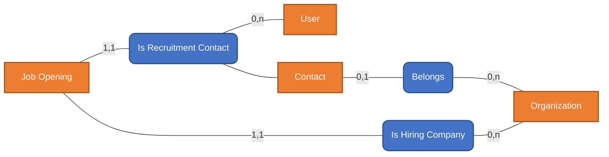
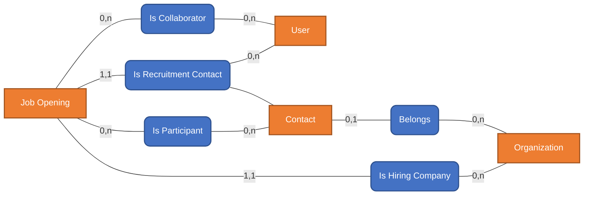

# Entity-Relationship Diagram

## Overview

This document describes the relationships between core entities in the HRIS/ATS system.

---

## Relationship 1: Organization → Contacts

**Description:** Contacts represent people associated with an organization (HR, managers, interviewers, external stakeholders).

```
Contact --"0,1"--> Belongs --"0,n"--> Organization
```

**Cardinality:**
- One Contact belongs to zero or one Organization
- One Organization has zero or many Contacts


---

## Relationship 2: Organization → Job Openings

**Description:** Each Job Opening belongs to one Hiring Organization.

**Important:** The organization represents:
- The hiring company (end-user case), OR
- The client company being recruited for (headhunter case)

```
Job Opening --"1,1"--> Is Hiring Company --"0,n"--> Organization
```

**Cardinality:**
- One Job Opening belongs to exactly one Organization
- One Organization has zero or many Job Openings

---

## Relationship 3: Job Opening → Recruitment Contact

**Description:** Each Job Opening has one Recruitment Contact that can be either a Tenant User or a Contact.

```
Job Opening --"1,1"--> Is Recruitment Contact --"0,n"--> User
                                            |
                                            +--"0,n"--> Contact
```

**Cardinality:**
- One Job Opening has exactly one Recruitment Contact
- One User can be Recruitment Contact for zero or many Job Openings
- One Contact can be Recruitment Contact for zero or many Job Openings



---

## Relationship 4: Contacts ↔ Job Openings (Participants)

**Description:** Contacts participate in Job Openings with a role. This information is used in the application.

**Roles:** Hiring Manager, Recruiter, Interviewer, HR Partner, Recruitment Coordinator, Decision Maker

```
Job Opening --"0,n"--> Is Participant --"0,n"--> Contact
```

**Cardinality:**
- One Job Opening has zero or many Participants (Contacts)
- One Contact participates in zero or many Job Openings

---

## Relationship 5: Users ↔ Job Openings (Collaborators)

**Description:** Users collaborate on Job Openings with a role. Roles are contextual to the Job Opening.

**Roles:** Hiring Manager, Recruiter, Interviewer, HR Partner, Recruitment Coordinator, Decision Maker

```
Job Opening --"0,n"--> Is Collaborator --"0,n"--> User
```

**Cardinality:**
- One Job Opening has zero or many Collaborators (Users)
- One User collaborates on zero or many Job Openings



---

## Relationship 6: Candidate Intake → Candidate → Application → Job Opening

**Description:** Candidate Intake can be allocated to more than one job opening. Once converted, it becomes a Candidate and can have Applications.

```
Candidate Intake == "Convert to" ==> Candidate
Candidate --"0,n"--> Application --"1,1"--> Job Opening
```

**Cardinality:**
- One Candidate Intake converts to one Candidate
- One Candidate has zero or many Applications
- One Application belongs to exactly one Job Opening
- One Job Opening has zero or many Applications


---

## Summary of All Relationships

| From | Relationship | To | Cardinality |
|------|--------------|-----|-------------|
| Contact | Belongs | Organization | 0,1 → 0,n |
| Job Opening | Is Hiring Company | Organization | 1,1 → 0,n |
| Job Opening | Is Recruitment Contact | User | 1,1 → 0,n |
| Job Opening | Is Recruitment Contact | Contact | 1,1 → 0,n |
| Job Opening | Is Participant | Contact | 0,n → 0,n |
| Job Opening | Is Collaborator | User | 0,n → 0,n |
| Candidate | Is Linked To | Candidate Intake | 0,n → 0,1 |
| Candidate | Application | Job Opening | 0,n → 0,n |
| Candidate Intake | Convert To | Application | - |

---

## Shared Entities (from CRM)

The following entities are shared with the CRM system:
- **Organization** - Same as CRM Organization
- **Contact** - Same as CRM Contact (People entity)
- **User** - Tenant User (internal)
- **Candidate** - Similar to CRM Contact
- **Candidate Intake** - Similar to CRM Lead
- **Application** - Similar to CRM Lead/Opportunity
