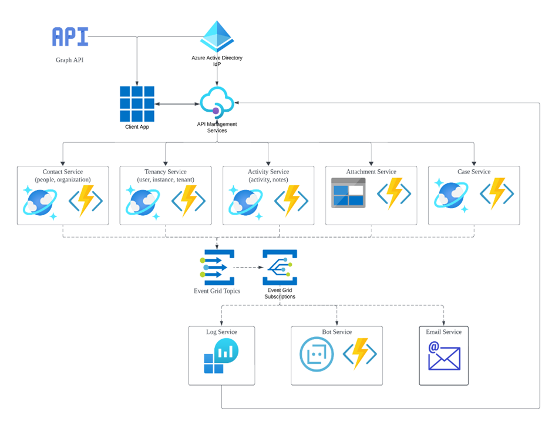

# Application Architecture

## Overview

This document describes the system architecture for the HRIS/ATS application.

---

## Architecture Diagram

> Note: This is a working document. Some components (e.g., subscription service) may not yet be fully represented.

---

## Architecture Layers

### 1. Entry and Authentication Layer

The top of the diagram shows how users and applications access the system.

| Component | Description |
|-----------|-------------|
| **API / Graph API** | External data interfaces or entry points |
| **Azure Active Directory (IdP)** | Identity Provider handling authentication and authorization |
| **Client App** | Primary user interface that connects to backend through management layer |

### 2. API Management Gateway

| Component | Description |
|-----------|-------------|
| **API Management Services** | Central gateway between Client App and core services. Manages traffic, security policies, and API versioning |

### 3. Core Microservices (Business Logic)

Five primary services, each responsible for a specific domain. Most utilize **Azure Functions** (serverless compute) and **Azure Cosmos DB** (NoSQL database).

| Service | Purpose | Technology |
|---------|---------|------------|
| **Contact Service** | Manages people and organization data | Azure Functions + Cosmos DB |
| **Tenancy Service** | Handles users, instances, and tenant configurations | Azure Functions + Cosmos DB |
| **Activity Service** | Tracks activities and notes | Azure Functions + Cosmos DB |
| **Attachment Service** | Manages files/media | Azure Functions + Azure Storage |
| **Case Service** | Handles specific cases or tickets | Azure Functions + Cosmos DB |

### 4. Event-Driven Messaging

Core services are connected via an asynchronous event layer.

| Component | Description |
|-----------|-------------|
| **Event Grid Topics** | When a change occurs in a core service (e.g., new Case created), an event is published here |
| **Event Grid Subscriptions** | Listen for specific events and route them to appropriate downstream consumers |

### 5. Downstream Services

Triggered by the Event Grid, these services perform secondary tasks.

| Service | Purpose | Technology |
|---------|---------|------------|
| **Log Service** | Tracks system behavior | Azure Monitor / Log Analytics |
| **Bot Service** | Automated assistant for notifications/interaction | Azure Functions |
| **Email Service** | Sends automated email notifications | Azure Functions |

**Feedback Loop:** Downstream services can trigger further actions within the core system through API Management Services.

---

## Data Flow

1. **User Action** → Client App
2. **Client App** → API Management Services
3. **API Management** → Appropriate Core Service
4. **Core Service** → Cosmos DB / Azure Storage (data persistence)
5. **Core Service** → Event Grid (publishes event)
6. **Event Grid** → Downstream Services (via subscriptions)
7. **Downstream Services** → API Management (feedback loop if needed)

---

## Technology Stack

### Compute
- **Azure Functions** - Serverless compute for microservices
- **Client App** - Web application (framework TBD)

### Data Storage
- **Azure Cosmos DB** - NoSQL database for core data
- **Azure Storage** - File storage for attachments

### Integration
- **Event Grid** - Event routing and pub/sub
- **API Management** - API gateway
- **Azure Active Directory** - Authentication/authorization

### Monitoring
- **Azure Monitor / Log Analytics** - Logging and monitoring

---

## Service Boundaries

### Contact Service
- Entities: People, Organizations
- Operations: CRUD, search, relationship management
- Events: PersonCreated, OrganizationUpdated, etc.

### Tenancy Service
- Entities: Users, Instances, Tenants
- Operations: User management, tenant configuration
- Events: UserCreated, TenantUpdated, etc.

### Activity Service
- Entities: Activities, Notes
- Operations: Log activities, query history
- Events: ActivityLogged, NoteAdded, etc.

### Attachment Service
- Entities: Files, Documents
- Operations: Upload, download, delete
- Events: FileUploaded, FileDeleted, etc.

### Case Service
- Entities: Cases, Tickets
- Operations: Case management, workflow transitions
- Events: CaseCreated, CaseStatusChanged, etc.

---

## Scalability Considerations

- **Serverless Functions** - Auto-scale based on demand
- **Cosmos DB** - Global distribution, automatic scaling
- **Event Grid** - Asynchronous processing prevents bottlenecks
- **Microservices** - Independent scaling of each service

---

## Security Architecture

1. **Authentication** - Azure Active Directory (IdP)
2. **Authorization** - Role-based access control (managed by Tenancy Service)
3. **API Security** - API Management Services handles security policies
4. **Data Security** - Cosmos DB encryption at rest
5. **Tenant Isolation** - Data partitioned by tenant ID

---

## Future Enhancements

Not yet represented in the architecture:
- Subscription Service
- Payment Processing
- Advanced Analytics
- AI/ML Services for candidate matching
