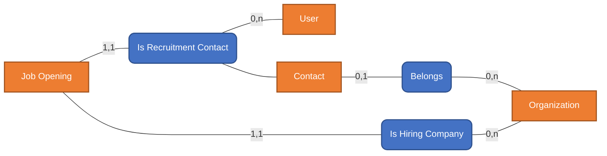
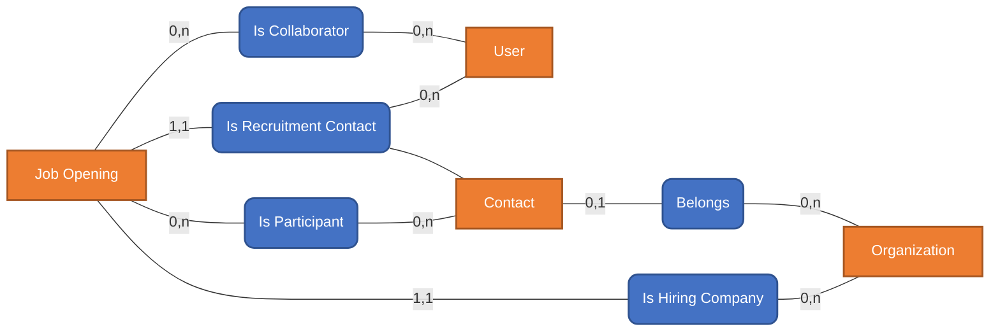
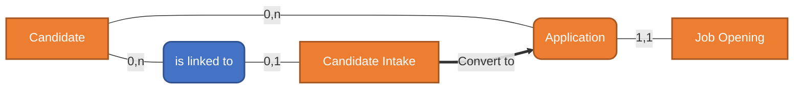

SECTION 1:
HRIS & ATS Introduction

An HRIS (Human Resources Information System) is a business application used to
a) support HR teams in managing people-related processes across the employee lifecycle, and
b) provide structure, visibility, and compliance for workforce data and operations.

An ATS (Applicant Tracking System) is a core module of an HRIS, focused specifically on talent acquisition, from job creation to hiring decision.

HRIS / ATS Core Processes

TALENT ACQUISITION (ATS)

"Talent acquisition is the set of business activities an organization uses to identify, attract, evaluate, and hire the right people.

It begins when an organization recognizes a need for new talent—whether to support growth, replace a departing employee, or acquire new skills—and ends when a hiring decision is made and the selected candidate joins the organization.

This process is not limited to posting job advertisements. It includes planning, market engagement, candidate evaluation, and decision-making, often involving multiple stakeholders such as HR teams, hiring managers, interviewers, and external partners.

For many organizations, especially recruitment agencies and headhunters, talent acquisition is also a core revenue-generating activity, where candidate quality, speed, and relationship management directly impact business success."

Job Opening Management

"Job opening management is about formalizing a hiring need and aligning all stakeholders around it.
A job opening usually defines:
- What role needs to be filled
- How many people are required

This clarity ensures that HR, hiring managers, and external recruiters all work toward the same objective.
In more complex scenarios—such as recruitment agencies—the job opening also establishes the commercial relationship between the recruiter and the client organization.

Throughout its lifecycle, a job opening may evolve due to:
- Budget changes
- Priority shifts
- Market conditions and Candidate availability
- Job desc adjustment"

Candidate Management

"Candidate management focuses on building and maintaining long-term relationships with talent.

A candidate may be relevant for multiple roles over time, either within the same organization or across different client organizations in the case of headhunters.

For recruitment agencies, the candidate database represents a strategic business asset.
Its value grows with:
- Quality of information
- Historical interactions
- Proven placements
- Trust built over time

Effective candidate management allows organizations to:

- Reuse talent instead of restarting searches
- Reduce hiring time and cost
- Improve candidate experience
- Make better-informed decisions"

Recruitment Pipeline

"The recruitment pipeline represents the decision-making journey from interest to hire.

It structures how candidates are evaluated, compared, and progressed. Each stage in the pipeline reflects a progress forward —from initial screening to interviews, assessments, and final offers.

At any point, either party may decide not to continue."

EMPLOYEE LIFECYCLE (HRIS)

TBD

Notes

"Depending on the role, industry, and company size:
Hiring cycles can be very short (a few days) or very long (several months)
One candidate may apply to multiple jobs
One job opening may have multiple hired candidates
A candidate record should remain reusable and traceable across job applications"

HRIS / ATS Typical Features

ATS Features

Configurable Job Opening Management  (Kanban & List view)
Candidate Management (Individual profiles)
Configurable Recruitment Pipeline (Kanban & List view)
Interview scheduling
Screening, Feedback & evaluation forms
…

HRIS Features

Employee Master Data Management
Organizational structure (departments, managers)
HR Case / Request Management
…

Core Features
Role & permission management
Document management
Activity logs (candidate, job opening, Recruitement pipeline, etc…)
Email & calendar synchronization (Outlook)

SECTION 2: Entities Description
HRIS / ATS Core Entities							
							
TALENT ACQUISITION (ATS)							
							
Organization (same as in CRM)							
							
"An Organization represents a legal or operational entity involved in the recruitment process.

Types of organizations:
A) End-User Organization (Direct Hiring)
An End-User Organization uses the ATS to manage recruitment for its own internal hiring needs.

In this scenario:
- The Organization entity represents the hiring organization
- The organization is both:
    - The customer of the ATS
    - The employer for all job openings
- The Organization entity will typically be a single, unique value in the system

B) Headhunter / Recruitment Agency
A Headhunter company uses the ATS to manage recruitment on behalf of multiple client organizations.

In this scenario:
- The ATS customer is the headhunter company
- The Organization entity represents the headhunter’s client companies (the hiring organizations)

Important note:
- The Organization entity always represents the hiring organization
- Job openings are always associated with an Organization Entity
- Candidates are managed by the hiring team and assigned to a job opening"							
							
Contact (same as in CRM)							
							
"A Contact represents an individual who participates in the recruitment process on behalf of an organization.
A Contact is always associated with exactly one Organization."							
							
							
Job Opening (Similar to Opportunity Entity) 							
							
HR, hiring managers or Head hunter create a Job opening							
							
							
Field Name	Type	Description	Comment				
Job Title	Text	Name of the position (e.g., Senior Backend Engineer)					
Job Reference / Code	Text	Internal or external reference ID					
Department	Dropdown list	HR, Finance, Sales, Marketing, Engineering, Product, Operations, Customer Support, IT, Legal					
Number of Hires	Number	Total number of hires planned for this job					
Hiring Organization	Link to other entity	Link to Organization (the company hiring)					
Recruitment Contact	Link to other entity	Primary business contact for this job. Can link to a Contact (external) or a Tenant User (internal).					
Other Participants	Link to other entity	Additional Contacts involved (e.g., client stakeholders, external reviewers).					
Collaborators	Link to other entity	Tenant Users collaborating internally on the job (recruiters, HR team members).					
		Participants and Collaborator can have a role: Hiring Manager, Recruiter, Interviewer, HR Partner, Recruitment Coordinator, Decision Maker. This list can be amended by ATS Owner					
							
[Default] Job description (same as document tabulation in CRM?)							
							
Executive summary / Introduction	Text area						
							
Job Classification							
Job Category	Drop-down list	e.g., Engineering, Sales, Marketing, HR, Finance, Operations					
Job Level	Drop-down list	e.g., Intern, Junior, Mid-level, Senior, Lead, Manager, Director					
Employment Type	Drop-down list	Full-time, Part-time, Contract, Freelance, Internship					
Contract Duration	Text	e.g., 6 months, 12 months, Permanent					
							
Location & Work Mode							
Work Location	Text	City / region					
Country	Drop-down list	List of supported countries <= default value to tenant country					
Work Mode	Drop-down list	On-site, Hybrid, Remote					
							
Skills & Requirements							
Required Skills	Multi-select list	Skills taxonomy (e.g., Java, React, Azure, Leadership)					
Nice-to-have Skills	Multi-select list	same list as above					
Minimum Experience	Numeric						
Maximum Experience	Numeric						
Education Level	Drop-down list	High School, Bachelor, Master, PhD					
Language Requirements	Multi-select list	e.g., English, French, German <= for each language, should be able to choose the level: Intermediate, Professional, Fluent					
							
Compensation & Benefits	Type	Description					
Salary Range (Min)	Number	Lower bound of compensation					
Salary Range (Max)	Number	Upper bound of compensation					
Salary Currency	Drop-down list	ISO currency codes (USD, EUR, SGD, etc.)					
Compensation Type	Drop-down list	Monthly, Yearly, Hourly					
Benefits Summary	Text Area	High-level benefits information					
							
							
Important Notes							
Fields can be added and removed	(Is there some mandatory fields?)						
All drop-down lists are configurable, not hard-coded							
							
(How to make section and field flexible?)							
							
Note: capability to upload word / pdf job description and populate the fields							
							
"Job Opening Lifecycle (Kanban)

A Job Opening can be in one of the following states:
- Draft
- Submitted
- Approved
- In Progress
- Closed
      - Filled
      - Partially Filled
      - Not Filled
Cancelled"							
							
							
Candidates in talent pool (Similar to Contact Entity in CRM).							
							
"A Candidate represents an individual who may be considered for one or more job opportunities.

The Candidate entity is job-agnostic and long-lived:
- It exists independently of any specific Job Opening
- It can be linked to multiple Applications over time
- It remains reusable even after hiring, rejection, or withdrawal
- the All Candidates DB is called the Talent Pool

The Candidate is a strategic asset, especially for headhunter and recruitment organizations."							
Field Name	Type	Description					
First Name	Text	Legal or preferred first name					
Last Name	Text	Legal or preferred last name					
Emails	List of emails						
Phone Numbers	List of Phone numbers						
Location	Text	City / region					
Country	Drop-down list	Configurable list of supported countries					
							
Professional Profile							
Current Job Title	Text	Most recent or current role					
Current Employer	Text	Current or last employer					
Years of Experience	Drop-down list	0–1, 2–4, 5–7, 8–10, 10+					
Seniority Level	Drop-down list	Intern, Junior, Mid-level, Senior, Lead, Manager, Director					
Professional Summary	Text Area	High-level career overview					
							
Skills & Expertise							
Core Skills	Multi-select list	Skills taxonomy (e.g., Java, React, Sales, Project Management)					
Secondary Skills	Multi-select list	Optional or complementary skills					
Industry Experience	Multi-select list	Finance, Healthcare, SaaS, Manufacturing, etc.					
Certifications	Tag	AWS, Azure, PMP, Scrum Master, etc.					
							
Education & Languages							
Highest Education Level	Drop-down list	High School, Bachelor, Master, PhD, Not Required					
Education Details	Text Area	Institutions, degrees, dates					
Languages	Multi-select list	Language list					
Language Proficiency	Drop-down list (per language)	Basic, Conversational, Fluent, Native					
…							
to be completed …							
(Shouldn’t the candidate form be shared with Job opening?)							
							
Capability to populate candidate information from: PDF/Word, Linkedin URL							
							
							
Candidate Intake (Similar to Lead in CRM)							
							
"Candidate Intake captures raw, early candidate profiles

Once reviewed or enriched, these profiles can be promoted to Candidates (Talent Pool)

In addition, when a candidate intake is deemed relevant for a specific job opening:
- A Candidates is created in Talent Pool
- When relevant, an application between the newly created candidate and a Job Opening is created (directly in recruitment pipeline)
- From this point forward, the candidate is treated the same as any applicant who applied directly to this job opening."							
							
Application (Similar to Lead / Opportunity Entity in CRM) / Recruitment Pipeline (Similar to Opportunity Pipeline)							
A Application represents a candidate’s candidacy for a specific Job Opening.							
Applications can either enter first an Applicants Triage, similar to Leads in CRM							
Ex: When applicant are coming from Email. Recruiter need to first review he relevancy of this candidate before it enter the Recruitment Pipeline							
							
Alternatively candidates can Join directly the Recruitment Pipeline							
ex: Candidates are coming from talent pool and are added to a Job Opening. Head hunter can choose to skip the Applicant Triage							
							
Applicant information (TBD)							
							
Field Name	Type	Description					
Candidate	Link to Candidate entity						
Job Opening	Link to Job Opening Entity						
Application Source	Drop-down list	Job Board, Referral, Direct Sourcing, Career Page, Agency					
Source Details	Text	Job board name, referral name, campaign					
Application Date	Date	When application was created					
							
Evaluation & Feedback							
Screening Score	Number	Initial screening score					
Overall Rating	Drop-down list	Poor, Average, Good, Very Good, Excellent					
Interview Feedback	TBD	Evaluation / feedback records					
Assessment Results	TBD	Test or assessment outcomes					
Decision Notes	Text Area	Final decision rationale					
							
							
Applicant Triage (List with preview)							
Objective: Decide whether this application is worth spending time on.							
This is a fast triage stage focused on relevance, not suitability.							
What happens here:							
High-level scan of the profile							
Minimal effort, high volume							
Decision is binary: Proceed or Stop							
							
Recruitment Pipeline (Kanban)							
							
HR screening							
Assessment / test							
Interviews							
Due Dilligence							
Offer Preparation							
Offer Sent							
Closed							
	Hired						
	Rejected						
	Withdrawn						
							
Select Candidates from DB and create application for job opening							

SECTION 3: ER Model
1 Organization → 0..N Contacts
Contacts represent people associated with an organization (HR, managers, interviewers, external stakeholders)

1 Organization → 0..N Job Openings			
Each Job Opening belongs to one Hiring Organization			
The organization represents:			
The hiring company (end-user case), OR			
The client company being recruited for (headhunter case)			
			
1 Contact / 1 Use → 0..N Job Openings			
Each Job Opening has one Recruitment Contact that can be either a Tenant user or a Contact			

0..N Contacts ↔ 0..N Job Openings
Contacts participate in Job opening with a role
This information will be use in the application

0..N Users ↔ 0..N Job Openings
Users Collaborate on a job posting with a role
Roles are contextual to the Job Opening

Candidate intake could be allocated to more
than 1 job opening

SECTION 4: App Architecture

Note: It's a working document, I haven't added everything to this architecture yet for example I haven't added the subscription service yet.
### **1. Entry and Authentication Layer**

The top of the diagram shows how users and applications access the system:

* **API / Graph API:** Represents external data interfaces or entry points.
* **Azure Active Directory (IdP):** Acts as the Identity Provider, handling authentication and authorization for the system.
* **Client App:** The primary interface that users interact with. It connects to the backend through the management layer.

### **2. API Management Gateway**

* **API Management Services:** Acts as the central gateway. It sits between the Client App and the core services, likely managing traffic, security policies, and API versioning.

### **3. Core Microservices (The Business Logic)**

There are five primary services, each responsible for a specific domain. Most utilize a combination of **Azure Functions** (serverless compute) and **Azure Cosmos DB** (NoSQL database):

* **Contact Service:** Manages people and organization data.
* **Tenancy Service:** Handles users, instances, and tenant configurations.
* **Activity Service:** Tracks activities and notes.
* **Attachment Service:** Manages files/media (using Azure Storage instead of Cosmos DB).
* **Case Service:** Handles specific cases or tickets.

---

### **4. Event-Driven Messaging**

The core services are connected via dashed lines to an asynchronous event layer:

* **Event Grid Topics:** When a change occurs in a core service (e.g., a new "Case" is created), an event is published here.
* **Event Grid Subscriptions:** These listen for specific events and route them to the appropriate downstream consumer.

### **5. Downstream Services**

Triggered by the Event Grid, these services perform secondary tasks:

* **Log Service:** Uses Azure Monitor/Log Analytics to track system behavior.
* **Bot Service:** An automated assistant (likely for notifications or user interaction) powered by Azure Functions.
* **Email Service:** Sends automated email notifications based on system events.
* **Feedback Loop:** A line connects these downstream processes back to the **API Management Services**, indicating that these services can trigger further actions within the core system.

SECTION 5: Mockup

Image Caption: Recruitment Management System Interface - Job Openings and Recruitment Pipeline

This image shows a user interface for a recruitment management system. The top section features a Kanban board view of "Job opening," where job opportunities are categorized by status: "Draft," "Submitted," "Approved," and "Recruitment In Progress." Each column displays the number of opportunities and a monetary value (all USD 0). Specific job opening cards, such as "Full Stack Developer for Astra" and "IT Head for Kitameraki Limited," are visible. There are also metric displays for "Nb Application per status in recruitment pipeline" and "Total Candidates Rejected."

The bottom section details a specific "Job Opening Form" for "IT Head for Kitameraki Limited." It includes a tabbed interface with the "Recruitment Pipeline" selected, showing a second Kanban board with application stages: "HR Screening," "Assessment / test," "Interviews," "Due Diligence," "Offer Preparation," and "Offer Sent." An applicant, "Sang Delattre," is shown in the "HR Screening" stage. Blue callout boxes with arrows point to and label various elements like the "List of All Job Opening, per status," "Recruitment pipeline," and "Application."